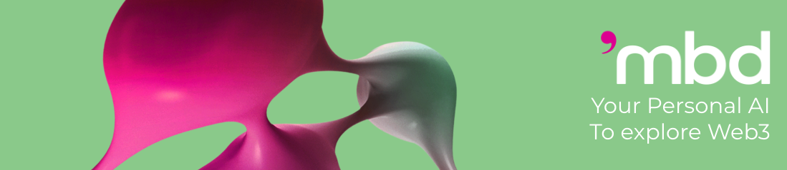
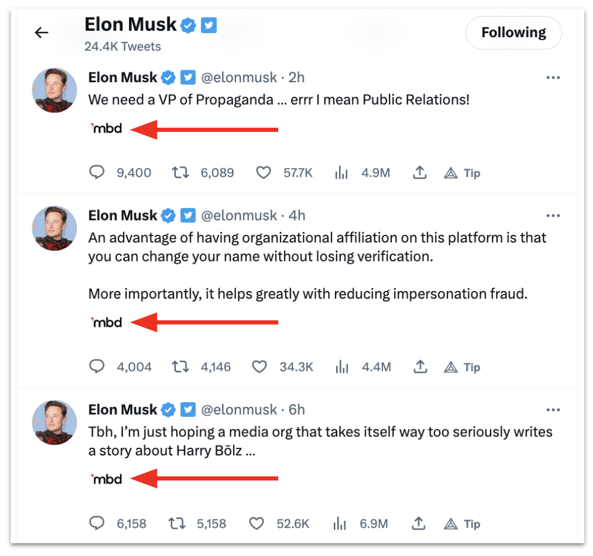
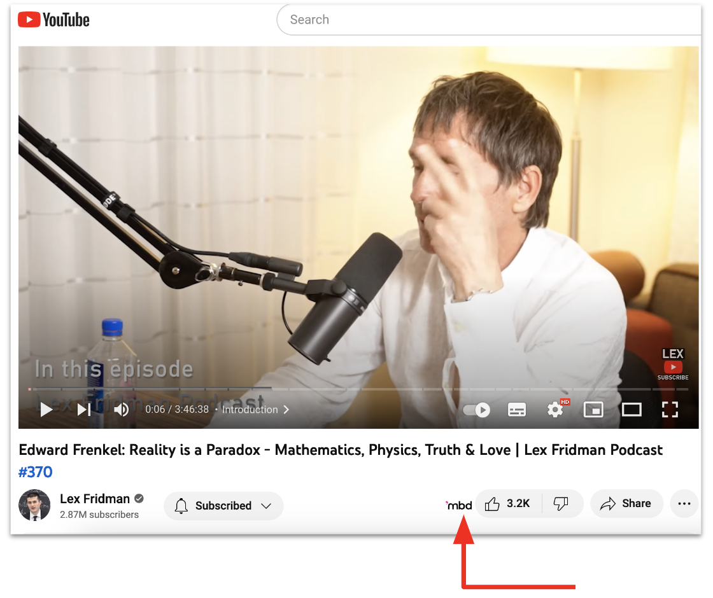
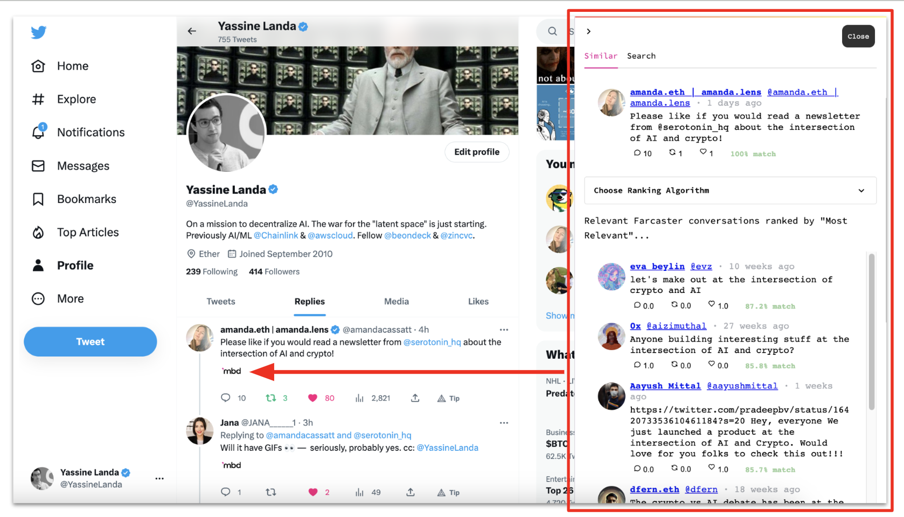
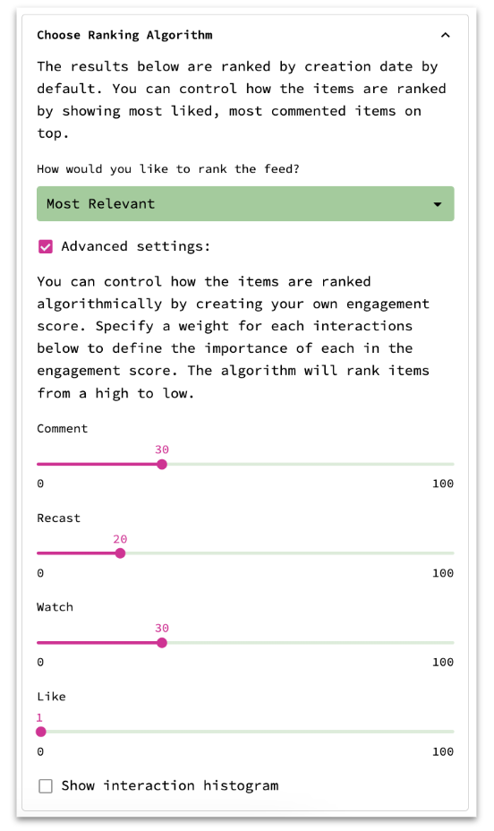

# Embed The World browser extension

## Welcome to Web3. Discover, Search, and Engage with the Open Internet! 

"**Embed The World**" is your social search engine & personal AI assistant in the browser: 

- Find relevant conversations to content you love. Discover the world of Web3!

- Craft the viral and resounding content that resognates with your target audience.

- Rank results by relevancy, recency, most commented, and more. Better create your own custom "AI Recommender"!

- Summarize, save, and schedule newsletter of your favorite social feeds. Connect to your favorite LLM provider or plug in your local model.

- Earn rewards for surfacing internet gems and monetize your feeds.

- Join a community of internet super users, power curators, and like minded curious people. 

## Manual installation 
1. Clone this repo to your machine
2. Open [chrome://extensions/](chrome://extensions/) in your browser
3. Check the box for Developer mode in the top right
4. Press __Load Unpacked__ button and select the folder with the code

You can start using the extension now.

## How to use "embed The World""
When you open a new tab with Twitter Feed or tweet or Youtube video you will see the **'mbd** logo near the tweet ot video title:

When you press it, it will open up a side panel where you can see relevant conversations from your favorites Web3 communities.

Use the "Choose Ranking Algorithm" to tailor how the results are ranked. You are in control.

 

## Feedback
If you have feedback, please create an issue in the repository or simply send me a DM in Twitter: [@YassineLanda](https://twitter.com/YassineLanda) or send us an email at: info@mbd.xyz
